# Red Hat Developer Hub Gitops Cluster Bootstrap

This project repo contains a set of ArgoCD manifests and a set of Ansible Playbooks used to bootstrap a Developer Hub Environment on top of Openshift v4.x. The produced environment is intended for Developer workflows demo.

It uses the ArgoCD **App of Apps pattern** to pre-install and configure a set of Openshift Operators to support Developer Workflows.

The following components should be provisioned by ArgoCD in your cluster:
 * **Openshift Dev Spaces**
 * **Kubernetes Image Puller Operator**
 * **Git Webhook Operator**
 * **Hashicorp Vault**
 * **Vault Config Operator**
 * **Openshift Pipelines**
 * **Patch Operator**
 * **...** (this list keeps growing as I need to add new components to this demo)

# First things first

[**Fork this repo**](https://github.com/redhat-na-ssa/redhat-developer-hub-gitops-bootstrap/fork) into your own GitHub profile and **Clone it** locally.

## Setup a GitHub Org and an Application

 1. Create a new [**Github Organization**](https://github.com/account/organizations/new?plan=free). This organization will contain the code repositories for the `components` created by Red Hat Developer Hub.

> ❗tip
  You may also use any organization you are a member of, as long as you have the ability to create new repositories within it.

 2. To help with the correct GitHub configuration set the following env vars in a terminal. 

```sh
K8S_CLUSTER_API=$(oc get Infrastructure.config.openshift.io cluster -o=jsonpath="{.status.apiServerURL}")
OPENSHIFT_CLUSTER_INFO=$(echo $K8S_CLUSTER_API | sed 's/^.*https...api//' | sed 's/.6443.*$//')
GITHUB_HOST_DOMAIN=github.com # if using a hosted Enterprise GitHub replace github.com by your internal domain.
GITHUB_ORGANIZATION=your-github-org-name-here
GITHUB_ORG_URL=https://$GITHUB_HOST_DOMAIN/$GITHUB_ORGANIZATION
```

 3. Create a new **GitHub Application** to use the `Git WebHooks` functionality in this demo.  The required fields will be populated, and correct permissions set.

``` sh
echo "https://$GITHUB_HOST_DOMAIN/organizations/$GITHUB_ORGANIZATION/settings/apps/new?name=$GITHUB_ORGANIZATION-rhdh-app&url=https://janus-idp.io/blog&webhook_active=true&public=false&callback_url=https://developer-hub-rhdh.apps$OPENSHIFT_CLUSTER_INFO/api/auth/github/handler/frame&webhook_url=https://developer-hub-rhdh.apps$OPENSHIFT_CLUSTER_INFO&administration=write&checks=write&actions=write&contents=write&statuses=write&vulnerability_alerts=write&dependabot_secrets=write&deployments=write&discussions=write&environments=write&issues=write&packages=write&pages=write&pull_requests=write&repository_hooks=write&repository_projects=write&secret_scanning_alerts=write&secrets=write&security_events=write&workflows=write&webhooks=write&members=read"
```

Click (or copy&paste it on your web browser) on the link echoed to your terminal and follow the wizard.

> **IMPORTANT**❗: Double check your Application has the following permissions set:
  
 * **Read** access to members and metadata
  
 * **Read and write** access to Dependabot alerts, actions, administration, checks, code, commit statuses, dependabot secrets, deployments, discussions, environments, issues, packages, pages, pull requests, repository hooks, repository projects, secret scanning alerts, secrets, security events, and workflows


 4. Generate a new client secret. Copy the App ID, App Client ID and Client Secret values and paste in a temporary txt file. Then, generate a `Private Key` for this app and **download** the private key file.

 5. Go to the `Install App` on the left side menu and install the GitHub App that you created for your organization. **Choose to install it to All Repositories under this Organization**.

## Setup a Quay Organization

 1. Create a new [**Quay Organization**](https://quay.io/organizations/new/). This organization will contain the image repositories for the `components` created by Red Hat Developer Hub.

> ❗tip
  You may also use any organization you are a member of, as long as you have admin rights within it.

 2. Then create a new OAuth Application (click on the last but one icon on the left side menu). No need to fill all the fields.
 3. Create a new OAuth 2 Access Token (click on the last icon on the left side menu) and make sure you check the following permissions:
   *  **Administer Organization**
   *  **Administer Repositories**
   *  **Create Repositiories**
   *  **Administer User**
 4. Copy the token and paste int on a temporary txt file.

## Enabling htpasswd authentication (OPTIONAL!)

If you got a "naked cluster" with just the `kubeadmin` system user. You can start by enabling the `htpasswd` auth provider and creating the `admin` user by using the `bootstrap-scripts/enable-htpasswd-users.sh`. 

This script will create the `admin` user as `cluster-admin` and 5 other regular (non-admin) users.

# Openshift GitOps installation and Cluster Bootstrap

## GitOps cluster bootstrap

 * Authenticate as a `cluster-admin` on your cluster and execute

```shell
 ./bootstrap-scripts/cluster-boostrap.sh 
```

This script will:
 * install Openshift GitOps (ArgoCD)
 * apply the ArgoCD root app
 * kickoff the cluster bootstrap
 
> NOTE: if installed Openshift GitOps (ArgoCD) using the Operator, take a look at the [openshift-gitops-install/argocd.yaml](openshift-gitops-install/argocd.yaml) CR as we enabled additional configs needed for this demo! Please, re-apply this CR to make sure you have ArgoCD proper configured for this demo.

After applying this manifest go to the ArgoCD web console and watch the provisioning.
> **IMPORTANT**❗: It will take a while (5-7min) to have all components provisioned and in healthy state. The provisioning happens in "waves". You may have to hit **Refresh** or **Sync** the root app in case it becomes unhealthy.

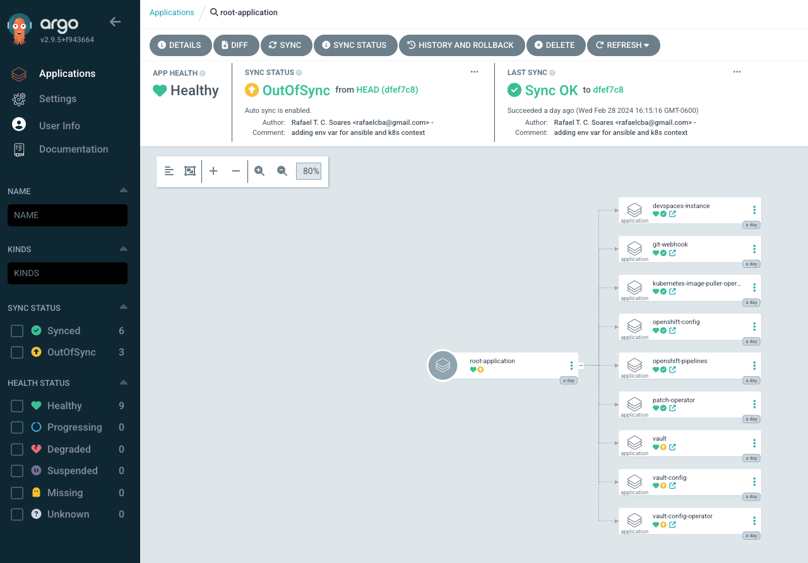

# Red Hat Developer Hub workflow (with Secret Management automation)

The following steps will setup the infrastructure represented in this Diagram

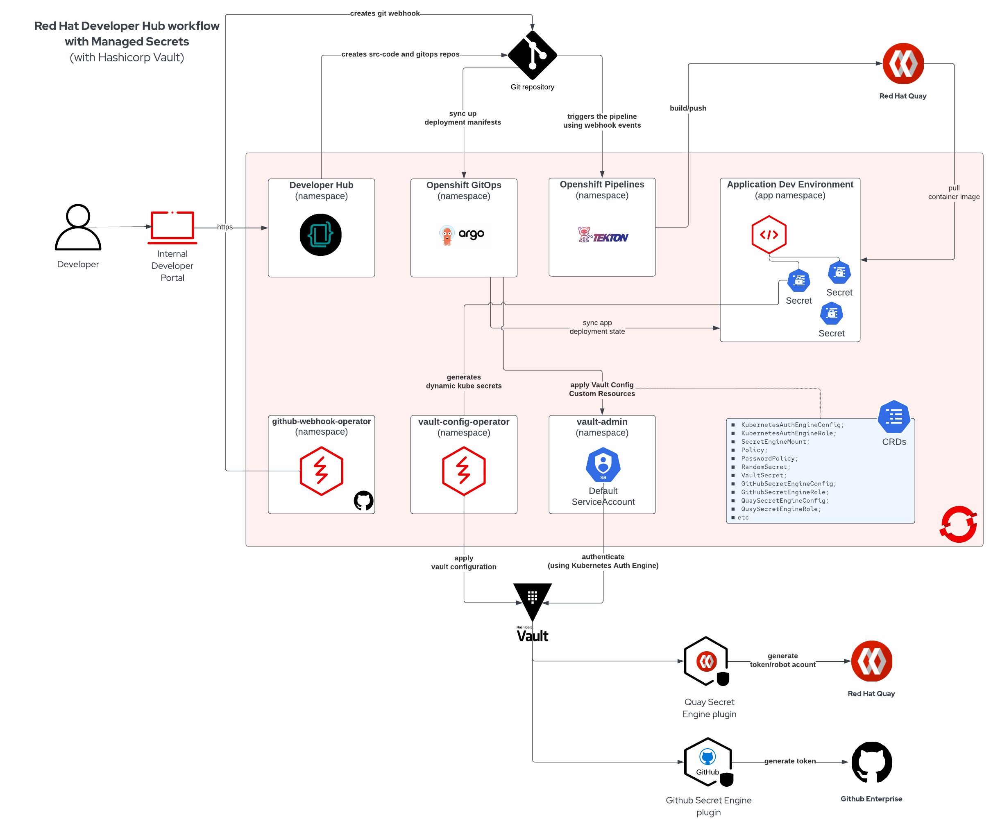

## Configuring Vault and Installing RHDH

### using Openshift Dev Spaces

If you don't have a Linux/MacOs box with Ansible installed with access to your Openshift cluster, you can create a Dev Workspace using **Openshift Dev Spaces** (already installed in your cluster) and use it to change files and run the oc CLI and execute the Ansible playbooks. To do so go to the Openshift Dev Spaces Dashboard

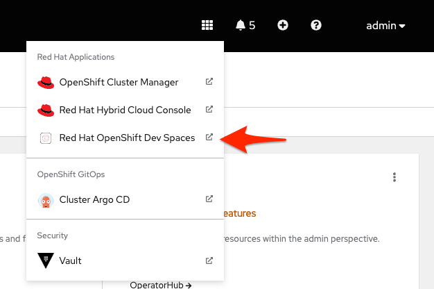

> NOTE: log in using an Openshift admin user!

and create a new workspace pointing to **your fork** of this repo. This repo contains a `devfile.yaml` ready for running Ansible.

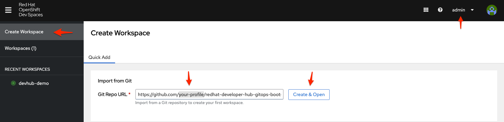

> NOTE: **Remember to login into Openshift using `oc` CLI with a `cluster-admin` user before you run Ansible!!!**. When running the playbooks inside a Dev Workspace you may need to export `K8S_AUTH_CONTEXT=cluster-admin-context-name`, so Ansible can use the correct cluster context to connect to Openshift. Use `oc config get-contexts` to get the context name where you logged as cluster admin.

### using your Linux/MacOS local environment

Its recommended to create and use a Python virtual environment to properly run these playbooks (**not needed if using DevSpaces workspace!**)

 * To create a Python venv and install ansible and the dependencies we need run
  
```sh
python3 -m venv .venv
source .venv/bin/activate
python3 -m pip install --upgrade pip
python3 -m pip install ansible hvac kubernetes
source .venv/bin/activate
```

### sourcing env vars

Before running these playbooks you need to setup a set of environment variables. 
To do so, create a hidden directory named `.ignored` (**this git repo is configured to ignore this directory on commit/push**). Then create a file named `env.sh` with the following content and add/replace their respective values according to your environment.

```sh
export GITHUB_APP_APP_ID=
export GITHUB_APP_CLIENT_ID=
export GITHUB_APP_CLIENT_SECRET=
export GITHUB_APP_PRIVATE_KEY_FILE=.ignored/your-github-app.private-key.pem
export GITHUB_PRIVATE_KEY=$(< $GITHUB_APP_PRIVATE_KEY_FILE)
export GITHUB_ORG=
export GITHUB_ORG_URL=https://github.com/your-github-org-name
export GITHUB_APP_WEBHOOK_URL=https://developer-hub-rhdh.your-cluster-domain-here/
export GITHUB_APP_WEBHOOK_SECRET=rhdh-secret
export QUAY_SERVER_URL=https://quay.io
export QUAY_ORG=your-quay-org-name
export QUAY_USER=a-quay-user-name
export QUAY_TOKEN=a-quay-oauth-app-token-with-admin-permissions
```

  * Source your env file before running Ansible.

```sa
source .ignored/env.sh
```

### running Ansible Playbooks

  * To configure our Vault Instance, run
  > This step will feed Vault with the secrets/credentials needed to access both Git Hub and Quay organizations. 

```sh
ansible-playbook ansible-automation/playbooks/vault-setup/main.yaml
```

  * To install and configure Red Hat Developer Hub, run

```sh
ansible-playbook ansible-automation/playbooks/rhdh-install/main.yaml
```

### changing the Vault Config resource kustomization file
Because we are using GitOps to configure the Vault Config Operator resources (CRs), we need to replace some values and then commit/push these changes to your forked git repo before we can proceed.

 1. Open the [operators/hashicorp-vault/kustomize/overlays/vault-config/kustomization.yaml](operators/hashicorp-vault/kustomize/overlays/vault-config/kustomization.yaml) file and replace any parameter value you see a `replace by...` comment. 

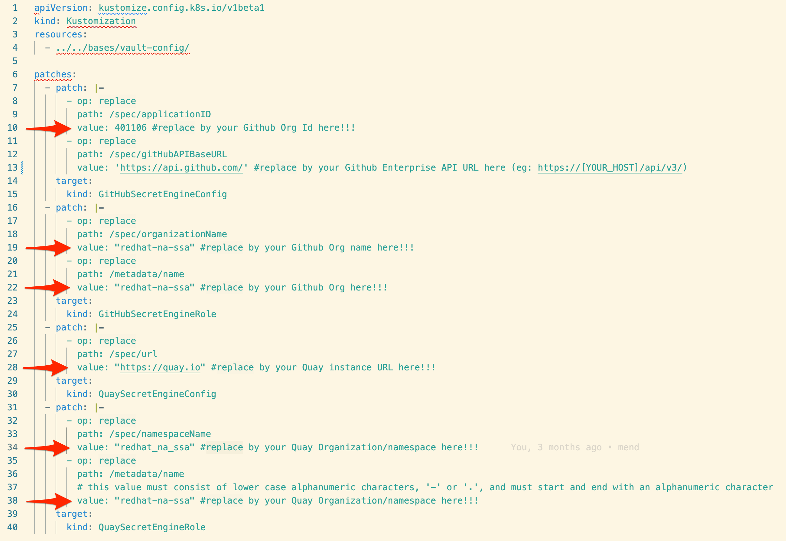

 2. save, commit and push this change!!!
 3. in a couple of minutes ArgoCD will sync this change on your Openshift cluster.

## Importing the sample Spring Boot software template into RHDH
To show case the fully automated dev workflow deppitect in this diagram

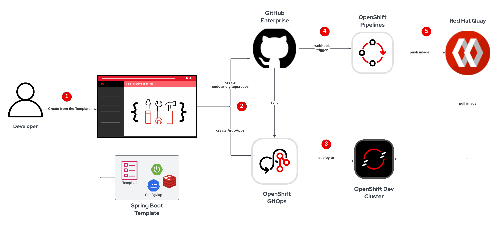

import the Backstage Software Template designed for this demo available here https://github.com/redhat-na-ssa/software-templates/blob/main/showcase-templates.yaml

# Enabling Github oAuth provider (OPTIONAL!)
I use this repo to bootstrap an Openshift Cluster to showcase Openshift Dev Tooling and Developer workflows on top of Openshift Platform.
For this I like to integrate Openshift and Openshift DevSpaces with Github. 

## Configuring Github oAuth for DevSpaces

 * Now go to https://github.com/settings/applications/new and create another GitHub app (now for DevSpaces)
 * Fill the fields with:
   * Application Name: `Openshift DevSpaces oAuth provider`
   * Homepage URL: `https://devspaces.apps.cluster-domain.com/`
   * Authorization callback URL: `https://devspaces.apps.cluster-domain.com/api/oauth/callback`

> **IMPORTANT:** <mark>Remember to copy the Client Id and the Client Secret values</mark>

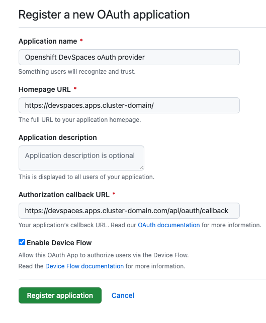

## Enabling Github users (developers) to access Openshift

 * Go to https://github.com/account/organizations/new?plan=free and create a new Github Personal Org"
 * Fill the fields with:
   * Organization Account Name: 'my-openshift-dev-team'
   * Contact email: 'your email address'
   * Check  'My personal account' for the Organization type

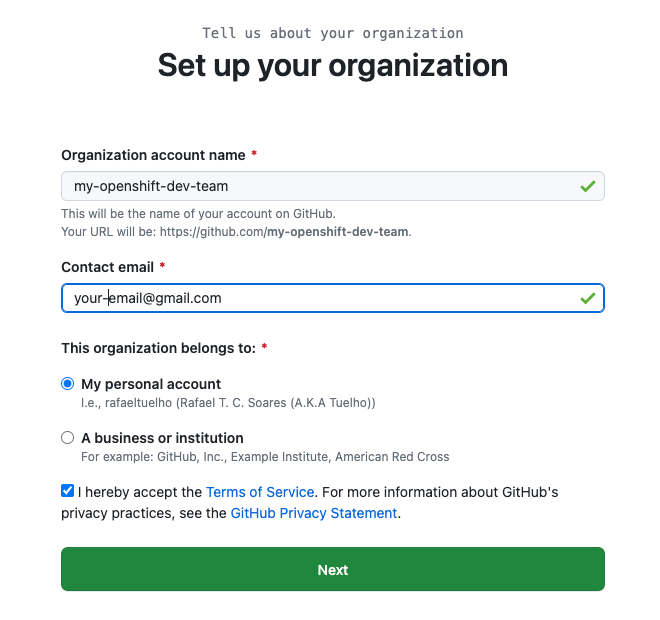

> **IMPORTANT:** After creating your Personal Org, make sure you add members to it (including yourself)
> Go to https://github.com/orgs/your-org-name/people and invite/add members

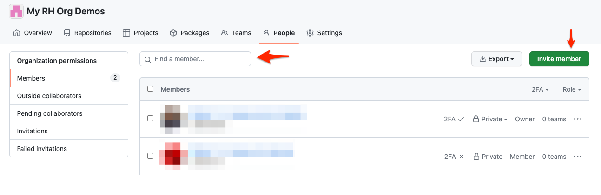

 * Now go to https://github.com/settings/applications/new and create a new GitHub app
 * Fill the fields with:
   * Application Name: `Red Hat Openshift oAuth provider`
   * Homepage URL: `https://console-openshift-console.apps.cluster-domain.com/`
   * Authorization callback URL: `https://oauth-openshift.apps.cluster-domain.com/oauth2callback/github`

> **IMPORTANT:** <mark>Remember to copy the Client Id and the Client Secret values</mark>

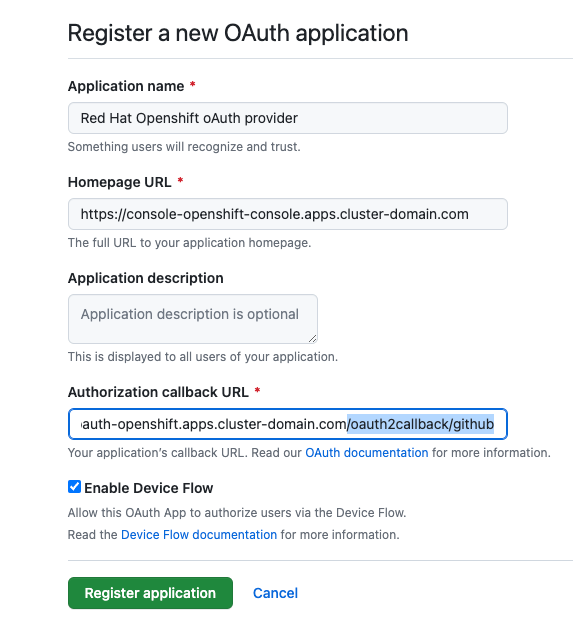

## Applying the Github oAuth configuration to your Openshift cluster

With the Github Org and oAuth Apps properly created, now is time to apply the required configuration in your cluster. 

**To make things easy I created a script to guide you in this configuration. Just execute the `bootstrap-scripts/setup-github-oauth.sh` and follow the instructions.**

> **NOTE:** After you create the github secrets the Patch Operator will catch the secret `ocp-github-app-credentials` (should be present in the `openshift-config` namespaces) and automatically configure the Cluster oAuth resource for you. 

In a couple of seconds you should be able to access the cluster using Github as an Identity Provider.

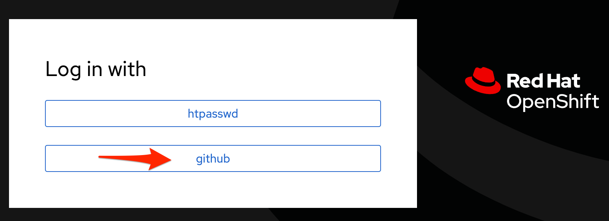
