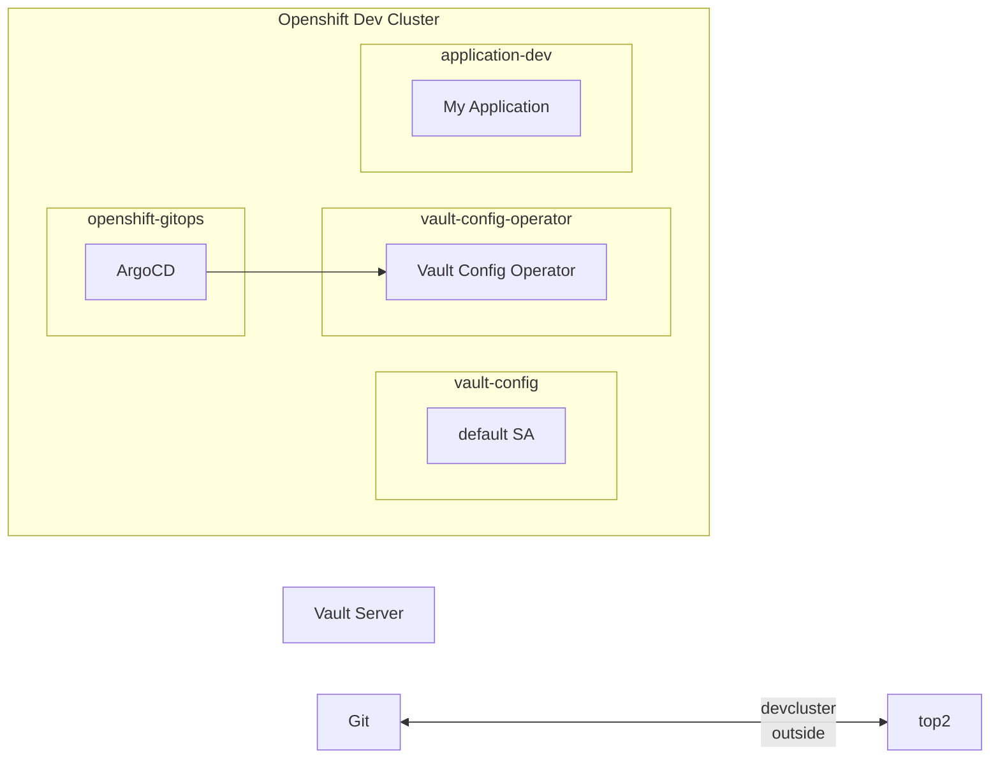

```mermaid
graph LR
    subgraph devcluster[Openshift Dev Cluster]
        direction LR
        subgraph gitops-ns[openshift-gitops]
        direction LR
        argocd[ArgoCD]
        end
        argocd-->vault-config-op
        subgraph vault-config-operator-ns[vault-config-operator]
        direction LR
        vault-config-op[Vault Config Operator]
        end

        subgraph vault-config-ns[vault-config]
        direction LR
        default-sa[default SA]
        end
        subgraph application-dev-ns[application-dev]
        direction LR
        application[My Application]
        end
    end
    vault[Vault Server]
    %% ^ These subgraphs are identical, except for the links to them:

    %% Link *to* subgraph1: subgraph1 direction is maintained
    git[Git] <-- devcluster
    %% Link *within* subgraph2:
    %% subgraph2 inherits the direction of the top-level graph (LR)
    outside ---> top2
 

 
```
